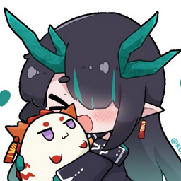

<div align="center">



<sub>Dusk (Arknights) fan art by <a href="https://x.com/kuro_tofu">KuroTofu (@Kuro_Tofu)</a></sub>

# Duski

A radial pie menu for Windows. Press a hotkey to chat with Claude or translate anything on your screen.


</div>

Duski runs in the system tray. Press **Ctrl+Shift+Space**, and a pie menu opens at your cursor:

| Key | Action | What it does |
|---|---|---|
| `1` | **Chat** | Opens a chat with a Claude agent that can use tools (files, shell, web). |
| `2` | **Translate text** | Translates the text you selected to English, in a popup next to the cursor. |
| `3` | **Translate area** | Lets you drag a box on the screen (like Lightshot) and translates the text in it. |
| `4` | **Todo** | Opens a notebook over `D:\Duski\todo.md`. Type `[] ` for a to-do and `@` for a reminder. Duski shows a toast when a reminder is due. |
| `5` | **Ask about text** | Asks Duski about the selected text: fix grammar, shorter, more formal, more casual, explain, or your own question. |
| `6` | **Ask about area** | Drag a box and ask about it: what is this, explain this error, extract the text, summarize, or your own question. |

Click a slice or press its number. Esc or a click outside the pie closes it.

## How it works

Duski is an Electron + TypeScript app. All AI work goes through the [Claude Code](https://docs.claude.com/en/docs/claude-code) CLI (`claude -p`). Duski uses your Claude subscription login, so it needs no API key.

- **Chat** runs `claude -p` in the agent home folder `D:\Duski\` with full tool access. Paste or drop images into the message box to attach them. Replies stream in as markdown. The conversation continues until you click **New chat**.
- **Chat** and **Ask** replies use an ADHD-friendly structure in ASD-STE100 Simplified Technical English. The prompt is `REPLY_STYLE_ARGS` in `src/main/claude.ts`. Rewrites, translations, and extracted text keep the tone you ask for.
- **Translate text** sends Ctrl+C to the active app, reads the clipboard, and then restores your old clipboard.
- **Translate area** takes a screenshot, crops your box to a PNG, and lets Claude read the image. No OCR library is needed. Claude returns each text block with its position, and Duski paints the English over the original text (like Google Lens), in colors sampled from the screenshot. The popup shows the same text. Closing the popup removes the overlay. `translateArea` needs a model with exact text positions: Sonnet works well, Haiku's boxes are too loose.

```
src/main/        tray, hotkey, pie, popup, chat, region capture, claude runner
src/main/actions one file per pie slice
src/renderer/    UI for the pie, popup, region overlay, and chat
static/          HTML and CSS
```

## Setup

### Requirements

- Windows 11
- [Claude Code](https://docs.claude.com/en/docs/claude-code) installed and logged in. Run `claude` once in a terminal to log in.
- [Node.js](https://nodejs.org) 24 or later (only to build from source)

### Install

```bash
git clone <this repo> Duski
cd Duski
npm install
npm run dist
```

Run `release\Duski Setup 0.1.0.exe`. It installs for your user only, with no admin rights. It adds a Start menu shortcut and a desktop shortcut.

> [!NOTE]
> The installer has no code signature, so Windows SmartScreen shows a warning. Click **More info → Run anyway**.

To start Duski with Windows, right-click the tray icon and select **Start with Windows**.

### Run from source

```bash
npm start
```

## Configuration

On first start, Duski creates the agent home `D:\Duski\`:

| File | Purpose |
|---|---|
| `config.json` | Duski settings (see below). Restart Duski after you change it. |
| `CLAUDE.md` | Rules and persona for the chat agent. |
| `.mcp.json` | MCP servers for the chat agent, for example Notion. |
| `notes\` | A place for the agent to save notes and reminders. |

`config.json`:

```json
{
  "hotkey": "Ctrl+Shift+Space",
  "claudePath": "claude",
  "models": { "chat": "sonnet", "translate": "sonnet", "translateArea": "sonnet" },
  "translateTimeoutSec": 60
}
```

> [!WARNING]
> The chat agent runs with `--dangerously-skip-permissions`. It can run any command and change any file that your user account can access.

## Add a pie action

1. Create a file in `src/main/actions/` that exports a `PieAction` (`id`, `label`, `icon`, `run(ctx)`).
2. Add it to the list in `src/main/actions/index.ts`. The list order sets the number keys.

The pie holds up to 8 actions.
