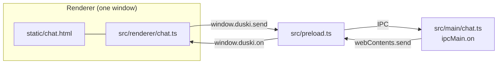
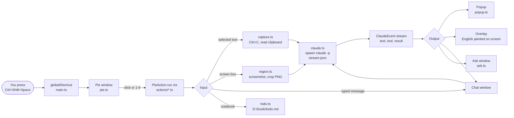
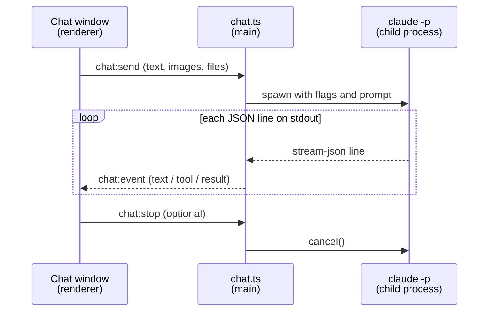

# How Duski works

Duski is a Windows tray app. You press a hotkey, and a pie menu opens at your cursor. Each slice of the pie is an action, for example "Translate text" or "Chat". All AI work goes through the Claude Code CLI (`claude -p`).

This document assumes that you do not know Electron yet. Read it from top to bottom one time. After that, use the diagrams as a map.

## 1. The stack

| Tool | What it is | Why Duski uses it |
|---|---|---|
| **Electron** | A framework to make desktop apps with web technology. Each window is a small Chrome browser page. Node.js runs behind the windows. | Duski gets windows, a tray icon, global hotkeys, and the clipboard from one library. |
| **TypeScript** | JavaScript with types. | The compiler finds errors before you run the app. |
| **esbuild** | A fast bundler. | `build.mjs` compiles all `.ts` files into `dist/`. Electron runs the files in `dist/`. |
| **Claude Code CLI** | The `claude` command-line program. `claude -p "prompt"` runs one prompt and exits. | Duski uses your Claude login, so it needs no API key. |
| **nut-js** | A library that sends real key presses to Windows. | Duski presses Ctrl+C in other apps to copy the selected text. |
| **marked + DOMPurify** | Markdown-to-HTML converter and an HTML cleaner. | The chat shows Claude's markdown replies safely. |

### Build and run

```bash
npm install     # download dependencies
npm start       # run build.mjs (esbuild), then start Electron
npm run typecheck   # check types only, no output files
npm run dist    # make the Windows installer in release/
```

## 2. The two halves of an Electron app

This is the most important idea. Every Electron app has two kinds of code.

| | Main process | Renderer process |
|---|---|---|
| Where | `src/main/` | `src/renderer/` and `static/*.html` |
| How many | One for the whole app | One for each window |
| Runs like | A Node.js program | A web page in Chrome |
| Can do | Files, child processes, hotkeys, clipboard, create windows | Draw HTML, read clicks and keys |
| Cannot do | Draw UI | Touch the computer directly |

The two halves cannot call each other's functions. They send messages over **IPC** (inter-process communication). A message has a channel name, for example `chat:send`, and some data.

`src/preload.ts` is the bridge. It runs before each page loads. It gives the page one object, `window.duski`, with three functions:

- `send(channel, ...args)`: send a message to the main process.
- `invoke(channel, ...args)`: send a message and wait for an answer.
- `on(channel, fn)`: listen for messages from the main process.

In the main process, `ipcMain.on('chat:send', ...)` receives the message. `win.webContents.send('chat:event', ...)` sends a message back to one window.



## 3. End to end



### Startup

`src/main/main.ts` runs first. It does these steps:

1. Make sure only one copy of Duski runs (`requestSingleInstanceLock`).
2. Load `D:\Duski\config.json` (`config.ts`).
3. Create the tray icon (`tray.ts`).
4. Run `claude --version`. If this fails, show a "Claude Code not found" message.
5. Register the IPC listeners for each window type (`initChatIpc`, `initPopupIpc`, and so on).
6. Give the action list to the pie (`initPie`).
7. Register the global hotkey (`globalShortcut.register`).

Duski does not quit when you close all windows. It stays in the tray.

### Example: "Translate text", step by step

1. You select text in any app and press **Ctrl+Shift+Space**.
2. `globalShortcut` calls `togglePie` in `pie.ts`. The pie window opens at the cursor.
3. You press `2`. The pie renderer sends `pie:pick` over IPC.
4. `main.ts` calls `action.run(ctx)` on `actions/translate-selection.ts`.
5. The action calls `ctx.getSelectedText()`. `capture.ts` saves your clipboard, presses Ctrl+C with nut-js, reads the text, and restores your clipboard.
6. The action gives the text to `translate()` in `actions/translate.ts`. "Translate area" uses the same helper.
7. `translate()` calls `ctx.showPopup(cursor)` to open a small popup. Then it calls `ctx.runClaude(...)` with a translate system prompt.
8. Each piece of text from Claude goes to the popup with `popup.update(...)`.
9. When Claude finishes, the popup shows the final translation.

If any step throws an error, `main.ts` shows the error message in a popup.

### The action context (`ctx`)

Every action gets one object, `ctx` (type `ActionContext` in `actions/types.ts`). It holds all the tools an action can use. An action does not import windows or the clipboard directly. This keeps each action file short.

| `ctx` member | What it does |
|---|---|
| `cursor` | Screen position of the cursor when you pressed the hotkey |
| `getSelectedText()` | Copies the selected text. Returns `""` if nothing is selected. |
| `selectRegion()` | Lets you drag a box on the screen. Returns a PNG path, or `null` if you press Esc. |
| `runClaude(options)` | Starts `claude -p` and streams events |
| `showPopup(point)` | Opens a popup and returns a handle to update it |
| `openChat()`, `openTodo()`, `showAsk(...)` | Open the other windows |

## 4. How Duski talks to Claude

`src/main/claude.ts` starts `claude` as a **child process**. A child process is a separate program that Node.js starts and controls (`spawn` from `node:child_process`).

Duski adds these flags:

- `-p`: run one prompt, then exit.
- `--output-format stream-json`: write one JSON object on each line, while Claude works.
- `--include-partial-messages`: send text in small pieces, so the UI can show it word by word.

`claude.ts` reads stdout line by line. It turns each line into a simple `ClaudeEvent`:

| Event | Meaning |
|---|---|
| `session` | The session ID. Chat uses it to continue the same conversation. |
| `text` | A new piece of reply text |
| `tool` | Claude starts a tool (for example, it reads a file) |
| `tool-result` | The output of that tool |
| `result` | Claude is done. Contains the full reply or an error. |

`runClaude` returns `{ done, cancel }`. `done` is a Promise that resolves when the process exits. `cancel()` stops the process. The **Stop** button uses it.



### Images and "Translate area"

Claude can read image files. "Translate area" and "Ask about area" do not use an OCR library:

1. `region.ts` takes a screenshot and shows a full-screen window. You drag a box.
2. Duski crops the box to a PNG file in a temp folder.
3. The prompt tells Claude to read that PNG file.
4. For "Translate area", Claude returns each text block with its position. `overlay.ts` paints the English text over the original text on the screen.

## 5. The six actions

| Key | Action | File | Input | Output |
|---|---|---|---|---|
| `1` | Chat | `actions/chat.ts` | Your message and images | Chat window, streamed markdown |
| `2` | Translate text | `actions/translate-selection.ts` | Selected text | Popup at the cursor |
| `3` | Translate area | `actions/translate-region.ts` | Screen box (PNG) | Popup and on-screen overlay |
| `4` | Todo | `actions/todo.ts` | `D:\Duski\todo.md` | Notebook window and reminder toasts |
| `5` | Ask about text | `actions/ask-text.ts` | Selected text and a question | Ask window |
| `6` | Ask about area | `actions/ask-area.ts` | Screen box and a question | Ask window |

## 6. Folders

| Folder | Contents |
|---|---|
| `src/main/` | Main process: tray, hotkey, pie, windows, capture, Claude runner |
| `src/main/actions/` | One file per pie slice |
| `src/renderer/` | Renderer code for each window |
| `src/shared/` | Types that both halves use, for example the chat event types |
| `src/preload.ts` | The IPC bridge (`window.duski`) |
| `static/` | HTML and CSS for each window |
| `dist/` | Build output. Do not edit. |
| `D:\Duski\` | Agent home: `config.json`, `CLAUDE.md`, `.mcp.json`, `todo.md` |

Most windows follow one pattern. Three files with the same name work together:

- `src/main/chat.ts` creates the window and handles IPC.
- `src/renderer/chat.ts` runs inside the window.
- `static/chat.html` and `static/chat.css` give the layout and style.

## 7. Add an action

1. Create a file in `src/main/actions/` that exports a `PieAction` (`id`, `label`, `icon`, `run(ctx)`).
2. Add it to the list in `src/main/actions/index.ts`. The list order sets the number keys.
3. Run `npm start` and press the hotkey to test it.

The pie holds a maximum of 8 actions.

## 8. Security note

The preload bridge lets every window start `claude` with full tool access. For this reason, `main.ts` blocks all navigation and all new windows. No window can load a remote web page.
